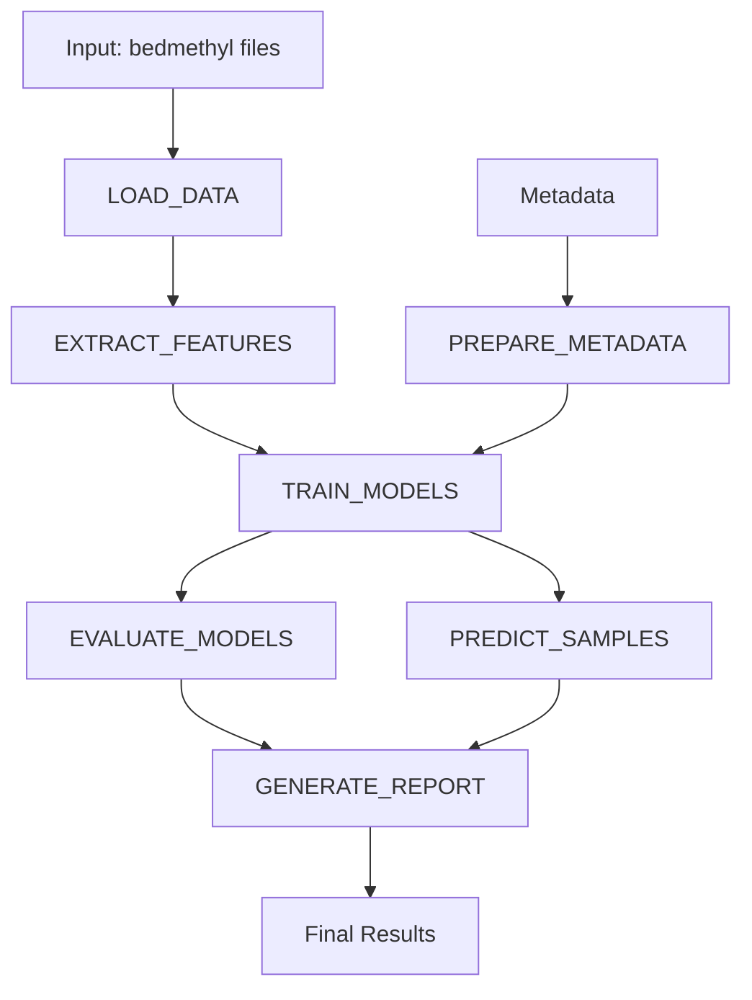

# MGMT Methylation Detection - Nextflow Pipeline

A scalable, reproducible Nextflow pipeline for detecting MGMT methylation status using genome-wide methylation data from Oxford Nanopore Technologies' modkit package.

## Overview

This Nextflow implementation of the MGMT methylation detection pipeline provides:
- **Scalability**: Process multiple samples in parallel
- **Reproducibility**: Consistent execution across different compute environments
- **Portability**: Run on local machines, HPC clusters, or cloud platforms
- **Resource Management**: Automatic resource allocation and job scheduling
- **Comprehensive Reporting**: Detailed execution reports and visualizations

## Quick Start

### Prerequisites

1. **Nextflow**: Install Nextflow (>=22.0.0)
```bash
curl -s https://get.nextflow.io | bash
sudo mv nextflow /usr/local/bin/
```

2. **Conda Environment**: Set up the mgmt_env environment
```bash
conda env create -f environment.yml
conda activate mgmt_env
```

### Basic Usage

#### Single Sample Analysis
```bash
nextflow run main.nf \
  --input /path/to/sample.wf_mods.bedmethyl.gz \
  --metadata metadata.csv \
  --outdir results
```

#### Multi-Sample Analysis
```bash
# Create samples.csv with sample information
nextflow run main.nf \
  --input samples.csv \
  --metadata metadata.csv \
  --outdir results
```

#### Using the Demo Script
```bash
./run_nextflow.sh
```

## Input Files

### 1. Sample Input (--input)

**Option A: Single bedmethyl file**
```bash
--input /path/to/sample.wf_mods.bedmethyl.gz
```

**Option B: CSV file with multiple samples**
```csv
sample_id,bedmethyl_path
T001,/path/to/T001.wf_mods.bedmethyl.gz
T002,/path/to/T002.wf_mods.bedmethyl.gz
T003,/path/to/T003.wf_mods.bedmethyl.gz
```

### 2. Metadata File (--metadata)

Required CSV file with sample labels:
```csv
sample_id,mgmt_status,batch,tissue_type
T001,methylated,batch1,tumor
T002,unmethylated,batch1,tumor
T003,methylated,batch2,tumor
```

**Required columns:**
- `sample_id`: Must match sample IDs in input
- `mgmt_status`: "methylated" or "unmethylated"

**Optional columns:**
- `batch`, `tissue_type`, `notes`: Additional metadata

## Pipeline Parameters

### Core Parameters
```bash
--input                  # Input file or CSV (required)
--metadata              # Sample metadata CSV (required)
--outdir                # Output directory (default: results)
```

### Data Processing Parameters
```bash
--min_coverage          # Minimum coverage threshold (default: 3)
--modification_types    # Modification types to include (default: m)
--chromosomes          # Comma-separated chromosomes (default: all)
```

### Feature Engineering Parameters
```bash
--window_sizes         # Window sizes for analysis (default: 1000,5000,10000,50000)
--scaling_method       # Feature scaling: robust, standard, none (default: robust)
```

### Model Training Parameters
```bash
--feature_selection    # Enable feature selection (default: true)
--n_features          # Number of features to select (default: 50)
--hyperparameter_tuning # Enable hyperparameter tuning (default: true)
--create_ensemble     # Create ensemble models (default: true)
```

## Execution Profiles

### Local Execution (Default)
```bash
nextflow run main.nf --input samples.csv --metadata metadata.csv
```

### Conda Environment
```bash
nextflow run main.nf --input samples.csv --metadata metadata.csv -profile conda
```

### Docker
```bash
nextflow run main.nf --input samples.csv --metadata metadata.csv -profile docker
```

### Singularity
```bash
nextflow run main.nf --input samples.csv --metadata metadata.csv -profile singularity
```

### HPC Clusters

#### SLURM
```bash
nextflow run main.nf \
  --input samples.csv \
  --metadata metadata.csv \
  -profile slurm \
  --outdir /scratch/username/mgmt_results
```

#### PBS
```bash
nextflow run main.nf \
  --input samples.csv \
  --metadata metadata.csv \
  -profile pbs
```

#### SGE
```bash
nextflow run main.nf \
  --input samples.csv \
  --metadata metadata.csv \
  -profile sge
```

### Cloud Execution

#### AWS Batch
```bash
nextflow run main.nf \
  --input s3://bucket/samples.csv \
  --metadata s3://bucket/metadata.csv \
  -profile awsbatch \
  --outdir s3://bucket/results
```

### Test Mode (Quick Testing)
```bash
nextflow run main.nf \
  --input samples.csv \
  --metadata metadata.csv \
  -profile test
```

## Pipeline Workflow



## Output Structure

```
results/
├── final_report.html           # Comprehensive HTML report
├── pipeline_summary.json       # Execution summary
├── predictions.csv             # MGMT predictions for all samples
├── features.csv               # Extracted methylation features
├── models/                    # Trained ML models
│   ├── random_forest_model.joblib
│   ├── ensemble_model.joblib
│   └── feature_selector.joblib
├── evaluation/                # Model evaluation
│   ├── roc_curves.png
│   ├── confusion_matrices.png
│   └── evaluation_report.txt
├── timeline.html              # Execution timeline
├── report.html               # Nextflow execution report
├── trace.txt                 # Process trace
└── dag.svg                   # Pipeline DAG
```

## Advanced Usage

### Custom Resource Allocation
```bash
nextflow run main.nf \
  --input samples.csv \
  --metadata metadata.csv \
  --max_memory 32.GB \
  --max_cpus 16
```

### Chromosome-Specific Analysis
```bash
nextflow run main.nf \
  --input samples.csv \
  --metadata metadata.csv \
  --chromosomes "chr1,chr2,chr10"
```

### Custom Feature Engineering
```bash
nextflow run main.nf \
  --input samples.csv \
  --metadata metadata.csv \
  --window_sizes "500,2000,15000" \
  --n_features 30 \
  --scaling_method standard
```

### Resume Failed Runs
```bash
nextflow run main.nf \
  --input samples.csv \
  --metadata metadata.csv \
  -resume
```

## Configuration

### Custom Configuration File
Create a custom `nextflow.config`:

```groovy
params {
    // Custom parameters
    min_coverage = 5
    n_features = 75
    hyperparameter_tuning = false
}

process {
    // Custom resource allocation
    withName: TRAIN_MODELS {
        cpus = 8
        memory = 24.GB
        time = 6.h
    }
}
```

Run with custom config:
```bash
nextflow run main.nf -c custom.config --input samples.csv --metadata metadata.csv
```

## Monitoring and Troubleshooting

### Monitor Execution
```bash
# View real-time log
tail -f .nextflow.log

# Check process status
nextflow log
```

### Resource Usage
- Check `timeline.html` for resource utilization
- Review `trace.txt` for detailed process information
- Examine `report.html` for execution statistics

### Common Issues

1. **Memory Errors**: Increase memory allocation in profiles
2. **Timeout Issues**: Extend time limits for large datasets
3. **Missing Dependencies**: Use conda or container profiles
4. **File Permissions**: Ensure read/write access to input/output directories

## Performance Optimization

### For Large Datasets
```bash
nextflow run main.nf \
  --input large_samples.csv \
  --metadata metadata.csv \
  --min_coverage 5 \
  --n_features 30 \
  --hyperparameter_tuning false
```

### Parallel Processing
The pipeline automatically parallelizes:
- Sample data loading
- Feature extraction across samples
- Model training (cross-validation)
- Evaluation processes

### Resource Recommendations

| Dataset Size | Memory | CPUs | Time |
|-------------|--------|------|------|
| 1-5 samples | 16 GB | 4 | 2-4 hours |
| 6-20 samples | 32 GB | 8 | 4-8 hours |
| 21+ samples | 64 GB | 16 | 8+ hours |

## Integration with Existing Workflows

### As a Nextflow Module
```groovy
include { MGMT_PIPELINE } from './main.nf'

workflow {
    MGMT_PIPELINE(
        input_ch,
        metadata_ch
    )
}
```

### With nf-core
The pipeline follows nf-core standards and can be integrated into larger genomics workflows.

## Citation

If you use this Nextflow pipeline in your research, please cite:

```
MGMT Methylation Detection Pipeline
Nextflow implementation for genome-wide methylation analysis
Version 1.0.0
```

## Support

For pipeline issues:
1. Check the execution reports (`timeline.html`, `report.html`)
2. Review the `.nextflow.log` file
3. Ensure all input files are accessible
4. Verify conda environment setup

## Examples

### Complete Workflow Example
```bash
# 1. Prepare input files
echo "sample_id,bedmethyl_path" > samples.csv
echo "S001,/data/S001.bedmethyl.gz" >> samples.csv
echo "S002,/data/S002.bedmethyl.gz" >> samples.csv

# 2. Create metadata
echo "sample_id,mgmt_status,batch" > metadata.csv
echo "S001,methylated,batch1" >> metadata.csv
echo "S002,unmethylated,batch1" >> metadata.csv

# 3. Run pipeline
nextflow run main.nf \
  --input samples.csv \
  --metadata metadata.csv \
  --outdir mgmt_results \
  --min_coverage 3

# 4. View results
open mgmt_results/final_report.html
```

This Nextflow implementation provides a robust, scalable solution for MGMT methylation detection that can handle datasets ranging from single samples to large cohort studies across various computing environments.

